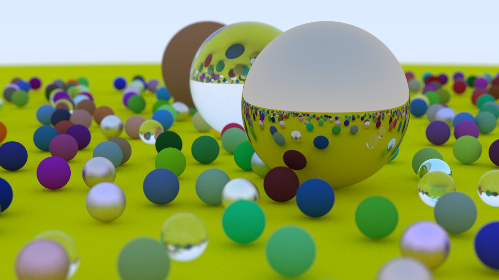

# Rust raytracer

Based off of the excellent ("Ray Tracing in One Weekend")[https://raytracing.github.io/books/RayTracingInOneWeekend.html] tutorial but with some extra changes.

This isn't anything special, it's just a demo project for learning :)



## Changes from reference

1. It's writen in rust (I just thought it'd be fun to learn)

## Configuring

Like in the original tutorial configurition is done in the main file `src/main.rs` where you can change 
* material properties : type of material, color, reflectivity, IRQ ...
* object properties : position, size, material
* camera properties : position, look position, FOV, focal point ...

## Building

This project is ***VERY*** CPU intensive so I would recommend you compile with the "release" option `-r`.
Like in the origin tutorial this operates by using shell pipes to write the `stdout` output to a file (a plain text `.ppm` file).

This project was developed on Linux and while it should compile on Windows and Mac OS, it's untested and I don't know how you'd pipe the data in a traditional Windows shell. 

```Bash
 cargo run -r > image.ppm
 ```